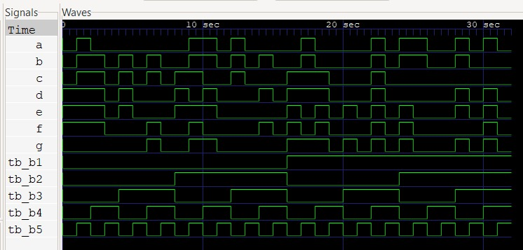

<p align="center">
  
  <br>
</p>
<div align=center>
    <a href="#desc">Descrição</a> | <a href="#prerequisites">Pré Requisitos</a> | <a href="#running">Rodando</a> | <a href="#resultados">Resultados</a> | <a href="#contribuidores">Contribuidores</a> 
</div>
<br>
<hr>
<h2 id="desc">
    Descrição
</h2>

Circuitos Combinacionais | Trabalho pratico pra disciplina de Introdução aos Sistemas Lógicos - UFV
- - - -

<h2 id="prerequisites">
    Pré Requisitos
</h2>

Basta baixar e instalar [IVerilog](http://iverilog.icarus.com/) com todas suas dependencias.

- - - -

<h2 id="running">
    Rodando
</h2>

Execute os seguintes comandos na pasta src do projeto:

```
iverilog -o run.vvp circuito_tb.v
```
```
vvp run.vvp
```

Para abrir o GTKWave interativo:

```
gtkwave
```
Logo após selecione o arquivo com a extensão .vcd para executar 

- - - -
<h2 id="resultados">
    Resultados
</h2>
Waves


Entradas e Saídas


- - - -
<h2 id="contribuidores">
    Contribuidores
</h2>

- [Angelo Cupertino Machado](https://github.com/acmachado14)
- [Arthur Fernandes Bastos](https://github.com/ArthurFBastos)
- [Jessica Cristina](https://github.com/JessCris)
- [Matheus Peixoto](https://github.com/MatheusPxt21)
